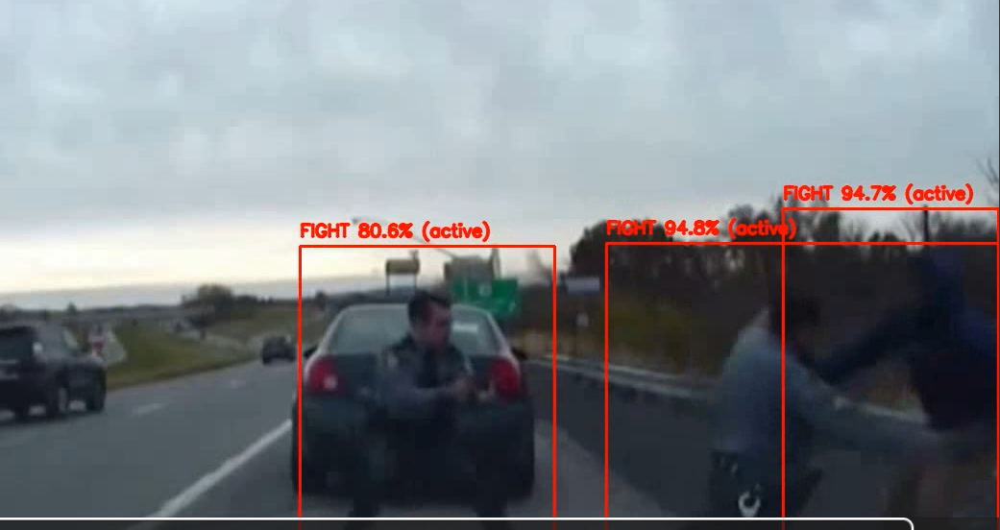
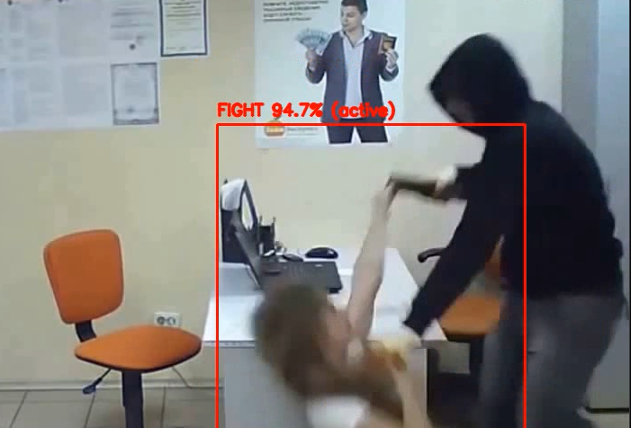

# Violence-Detection-Video-Analytics

## YOLO11 + R3D-18 + Multi-Object Tracking + Motion Filtering

This repository contains a **real-time violence (fight) detection system** designed for CCTV and surveillance applications.  
It uses deep learning for person detection, action classification, motion analysis, and temporal validation to deliver highly accurate fight alerts.

---

# 📌 Features

### 1. Person Detection — _YOLO11_

Detects all people in each frame with high accuracy and speed.

### 2. Fight Classification — _3D CNN (R3D-18)_

A custom-trained **3D ResNet-18** model classifies 16-frame video clips as:

- **Fight**
- **Non-Fight**

### 3. Multi-Object Tracking (SORT-like)

Tracks every person across frames and assigns a unique ID, enabling:

- Person-specific predictions
- Temporal stability
- Fight confirmation per individual

### 4. Motion-Based Activity Filtering

Reduces false positives by classifying each tracked person as:

- **Idle** → ignore
- **Walking** → ignore
- **Active movement** → candidate for fight

### 5. 2-Second Confirmation Rule

A fight is only confirmed if:

- Model predicts fight
- Person is active (not standing/walking)
- Condition lasts **>= 2 seconds**

This drastically reduces flicker and false alarms.

### 6. Annotated Output

The system outputs a video with:

- Red bounding boxes
- Text labels like:  
   `FIGHT 87% (active)`  
  Only confirmed fighters are displayed.

---

# 📂 Dataset

This project uses the **RWF-2000 dataset**, which contains:

- 2000 surveillance videos
- Two classes: **Fight / Non-Fight**
- Train/Validation split maintained as in original paper

Structure:

```
dataset/
   train/
      Fight/
      NonFight/
   val/
      Fight/
      NonFight/
```

---

# 🧠 Model Training

### 1. YOLO11 Detection

Used to generate:

- Bounding boxes
- Person tracking
- Person-level cropped clips

### 2. R3D-18 Action Classifier

Trained on the generated clips:

- Input: 16×112×112 frames
- Labels assigned based on video name (Fight=1, NonFight=0)
- Achieved **~78–80% validation accuracy**

---

# 🏗️ System Architecture

```
Video → YOLO Person Detection → Multi-Object Tracking
      → Per-Person Clip Buffer → R3D-18 Classification
      → Motion Activity Check → 2-Second Fight Confirmation
      → Final Annotated Output Video
```

---

# 📦 Directory Structure (recommended)

```
violence-detection/
│
├── dataset/
│   ├── train/
│   └── val/
│
├── workspace/
│   ├── detections/       # YOLO detection JSONs
│   ├── tracks/           # Tracking JSONs
│   ├── frames/           # Optional frame dumps
│   ├── clips/            # 16-frame person clips (.npy)
│   ├── models/           # Checkpoints + best model
│   └── inference_outputs/
│
├── src/
│   ├── preprocess_detect.py
│   ├── preprocess_track.py
│   ├── preprocess_clips.py
│   ├── train_classifier.py
│   ├── inference.py
│   └── utils.py
│
└── README.md
```

---

# ▶️ How to Run Inference

```bash
python src/inference.py --video Test-Video.mp4
```

This generates:

```
workspace/inference_outputs/Test-Video-Output.mp4
```

---

# 🤖 Technologies Used

- **Python**
- **PyTorch**
- **TorchVision**
- **Ultralytics YOLO**
- **OpenCV**
- **NumPy**

---

# 🛠️ Requirements

```
torch
torchvision
ultralytics
opencv-python
numpy
```

Install:

```bash
pip install -r requirements.txt
```

# Violence Detection Images

### Output 1



### Output 2



# 🚀 Applications

- Smart Surveillance
- Public Safety Monitoring
- Industrial Safety Systems
- Smart City Solutions
- Automated Security Alarms

---
